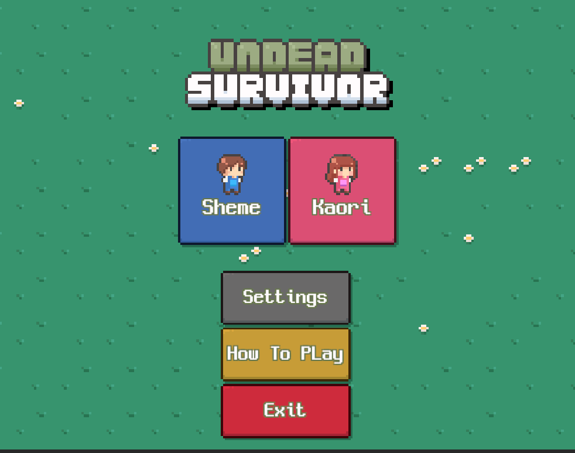

<div align="center">

# 🧟 Undead Survivor

**A thrilling survival game inspired by Vampire Survivors**

[](https://unity3d.com/get-unity/download)
[](LICENSE)
[](https://github.com/AnPhuoc2410/Undead_Survivor)

*Battle endless waves of enemies, collect experience, and upgrade your character to survive as long as possible!*

</div>

---

## 🎮 Game Overview

Undead Survivor is a fast-paced, action-packed survival game where you face relentless waves of undead enemies. Use strategy, quick reflexes, and powerful upgrades to survive the apocalypse!

## ✨ Features

🌊 **Endless Enemy Waves** - Face increasingly challenging hordes of undead  
⚡ **Character Progression** - Unlock traits and upgrades as you level up  
🔫 **Arsenal of Weapons** - Discover and upgrade multiple weapon types  
📈 **Experience System** - Gain XP and evolve your playstyle  
🎵 **Dynamic Audio & UI** - Immersive sound design and responsive interface  
🎯 **Strategic Gameplay** - Plan your builds and survive longer each run  

## 🚀 Getting Started

### Prerequisites
- **Unity Editor**: Version 6000.0.48f1 or later
- **Platform**: Windows/Mac/Linux

### Installation

1. **Clone the repository**
   ```bash
   git clone https://github.com/AnPhuoc2410/Undead_Survivor.git
   cd Undead_Survivor
   ```

2. **Open in Unity**
   - Launch Unity Hub
   - Click "Open" and select the project folder
   - Wait for Unity to import all assets

3. **Import Game Assets**
   - Download the asset pack from the link below
   - Import into your Unity project

4. **Start Playing**
   - Press the **Character** button to begin your survival journey!

## 📦 Required Assets

> **Important**: This project requires external assets to function properly.

[](https://assetstore.unity.com/packages/2d/undead-survivor-assets-pack-238068)

**Undead Survivor Assets Pack** - Contains all sprites, animations, and audio files needed for the game.

## 📸 Screenshots & Gameplay

<div align="center">

### 🏠 Main Menu


### 🎮 In-Game Action


*Add your epic gameplay moments here! Screenshots of intense battles, character upgrades, and high scores are welcome.*

</div>

## 🎯 How to Play

- **Move**: Use WASD or Arrow keys to navigate
- **Survive**: Avoid enemy contact while your weapons auto-attack
- **Level Up**: Collect experience gems to gain new abilities
- **Strategize**: Choose upgrades that complement your playstyle

## 🛠️ Built With

- **Game Engine**: Unity 6000.0.48f1
- **Camera System**: Cinemachine
- **Programming Language**: C#
- **Art Style**: 2D Pixel Art

## 🤝 Contributing

We welcome contributions from the community! Here's how you can help:

1. **Fork** the repository
2. **Create** a feature branch (`git checkout -b feature/AmazingFeature`)
3. **Commit** your changes (`git commit -m 'Add some AmazingFeature'`)
4. **Push** to the branch (`git push origin feature/AmazingFeature`)
5. **Open** a Pull Request

## 📝 Credits & References

- 🎮 **Inspired by**: [Vampire Survivors](https://store.steampowered.com/app/1794680/Vampire_Survivors/) - The legendary survival game
- 📹 **Camera System**: Cinemachine for smooth player following
- 🎨 **Art Assets**: Undead Survivor Assets Pack from Unity Asset Store

## 👥 Contributors

Thanks to all the amazing people who have contributed to this project! ✨

<div align="center">

<a href="https://github.com/AnPhuoc2410/Undead_Survivor/graphs/contributors">
  
</a>

</div>

---

<div align="center">

**🔥 Survive the Undead Apocalypse! 🔥**

Made with ❤️ by AnPhuoc2410

[⭐ Star this repo](https://github.com/AnPhuoc2410/Undead_Survivor) | [🐛 Report Bug](https://github.com/AnPhuoc2410/Undead_Survivor/issues) | [💡 Request Feature](https://github.com/AnPhuoc2410/Undead_Survivor/issues)

</div>